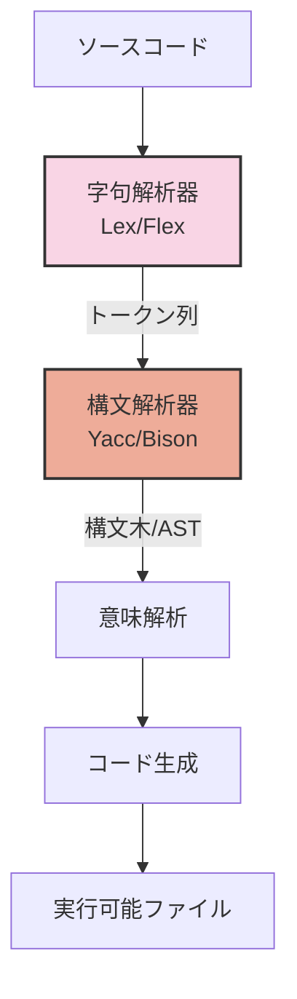
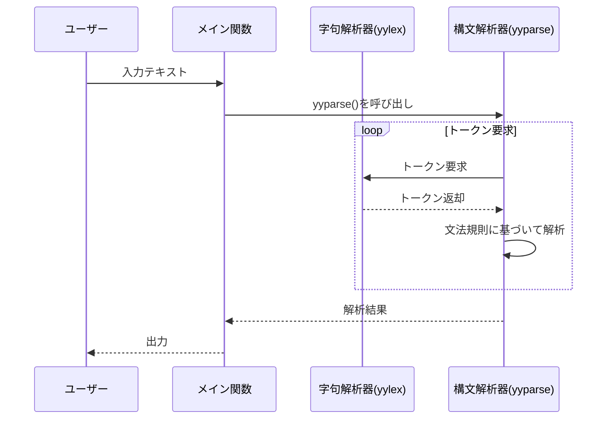

# パーサー学習用リポジトリ (study_of_parser)

このリポジトリは字句解析器(lexer)と構文解析器(parser)の基本概念を学ぶための実践的なサンプル集です。
最初はRubyKaigi 2025に向けてRubyのパーサーについて学ぶために作成されましたが、一般的なパーサー技術の学習にも役立ちます。

## パーサーの基本的な処理フロー



## LexとYaccの連携



## 前提条件

このリポジトリのサンプルを実行するには以下のツールが必要です：

- flex (lex) - 字句解析器ジェネレーター
- bison (yacc) - 構文解析器ジェネレーター
- C コンパイラ (gcc/clang など)

### インストール方法

**macOS:**
```bash
brew install flex bison
```

**Ubuntu/Debian:**
```bash
sudo apt-get install flex bison
```

## リポジトリ構成

このリポジトリは主に以下の2つのディレクトリで構成されています：

### 1. lex/ - 字句解析の基礎

字句解析器(lexer)の基本機能を学ぶための例：

- **word_count/** - 単語数、文字数、行数をカウントする簡単なプログラム
- **line_number/** - ファイルに行番号を追加する例
- **tokenize_expr/** - 数式をトークン化する例
- **recognize_expr/** - 数式を認識する例

### 2. yacc/ - 構文解析の基礎

構文解析器(parser)の基本機能を学ぶための例：

- **calc/** - 簡単な電卓プログラム
- **detect_syntax_error/** - 構文エラーを検出する例
- **ast/** - 抽象構文木(AST)の構築例

## 使い方

各ディレクトリには独自のMakefileが含まれています。サンプルをビルドして実行するには、対応するディレクトリに移動して以下のコマンドを実行します：

```bash
cd lex/word_count
make
./lexer  # 生成された実行ファイルを実行
```

各サンプルの具体的な使い方は、それぞれのディレクトリ内のREADMEを参照してください。

## 学習の進め方

初めてlexとyaccを学ぶ場合は、以下の順序で進めることをお勧めします：

1. lex/word_count - 最も基本的な字句解析の例
2. lex/line_number - 入力処理の基本的な操作
3. lex/tokenize_expr - トークン化の概念
4. lex/recognize_expr - パターン認識
5. yacc/calc - 基本的な構文解析と計算
6. yacc/detect_syntax_error - エラー処理
7. yacc/ast - 抽象構文木の構築

## ライセンス

MIT License
