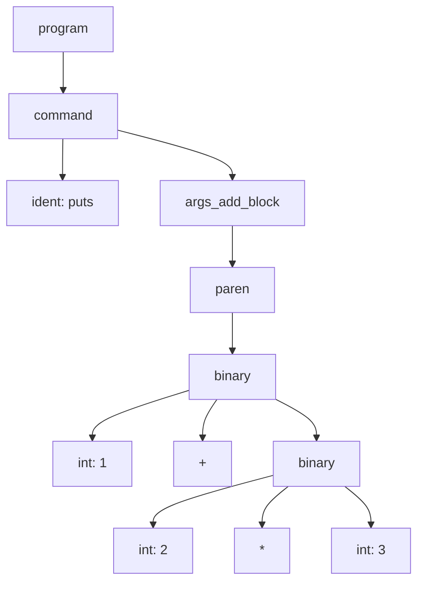
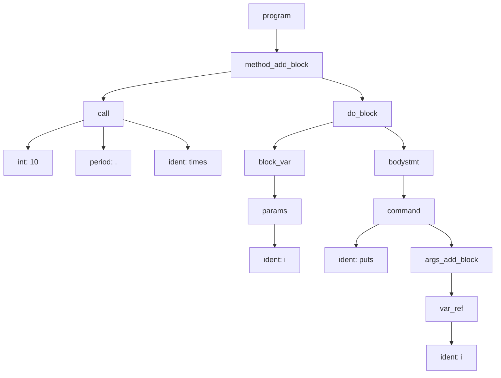

# parser

parser の仕事は大きく分けて以下の2つです。

1. 与えられたトークン列が、プログラミング言語の構文として正しいかどうかを判定する。(構文解析)
2. トークン列をインタプリタが理解できる構造に変換する。

一つずつ処理を見ていきましょう。

## 1. 構文解析

与えられたトークン列が、プログラミング言語の構文として正しいかどうかを判定する処理をここでは構文解析と呼ぶことにしましょう。
構文解析は、基本的に以下のような処理を行います。

1. 与えられたトークン列を一つずつ Stack に push する
2. ワンステップずつ Stack に積み上がったトークンに文法規則を繰り返し適用していく
3. 最終的に開始記号が得られれば構文として正しいことが保証できる

@TODO: スライドで説明する

@TODO: LALR の説明をする


## 2. AST の生成

インタプリタが理解できる構造は木構造であり、 AST (Abstract Syntax Tree) と呼びます。

例えば以下のようなコードが与えられたとき、

```ruby
puts (1 + 2 * 3)
```

lexer によって以下のようなトークン列に分割されるわけですが、

```
(identifier, puts)(paren, ()(integer, 1)(plus, +)(integer, 2)(asterisk, *)(integer, 3)(paren, ))
```

これだけではインタプリタは処理内容を理解できません。

そこで、parser はこのトークン列を以下のような AST に変換します。



なぜこの AST を生成する事でインタプリタが理解できる構造になるのか、つまりインタプリタがこの AST を利用してどのようにバイトコードを生成するのかに関しては土方さんのセッションの方で解説していただきます。
本セッションでは、この AST をどのように生成するのか、という部分に焦点を当てて説明します。

## AST をどのようにして生成するのか？

※ ちなみに先ほどのスクリプトの場合、以下のような AST が生成されます。(複雑に見えるけど、よく見ると読めるはず... )


