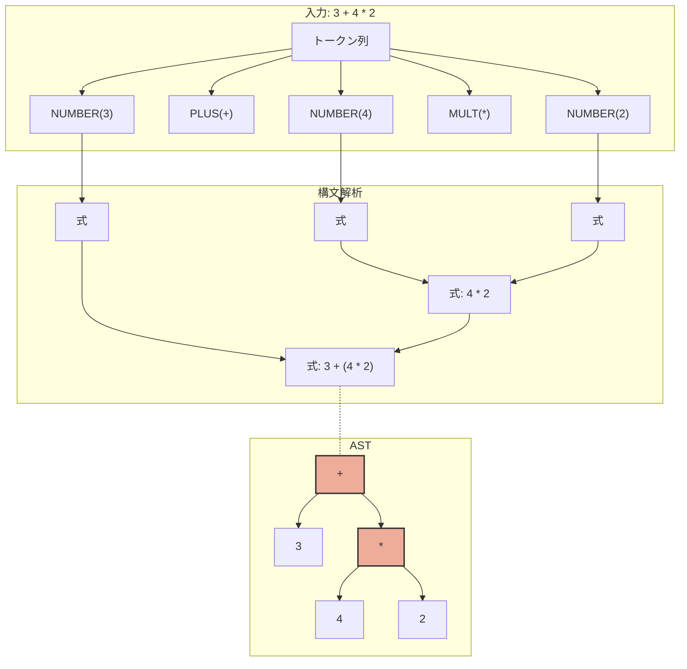
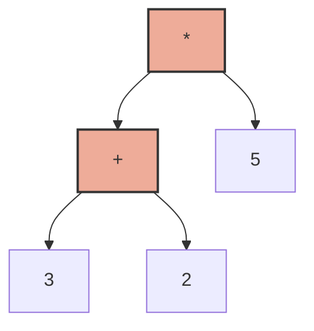

# 抽象構文木（AST）構築プログラム

この例では、入力された数式から抽象構文木（Abstract Syntax Tree, AST）を構築する方法を実装しています。

## 構文解析とASTの構築プロセス



## ASTの具体例

以下は式 `(3 + 2) * 5` のASTです：



この木構造により、演算子の優先順位や括弧による演算順序が明確に表現されています。

## 学習ポイント

- 抽象構文木の概念と構造
- 構文解析中のノード構築
- 木構造の操作と評価

## 実行方法

```bash
make
./calc
```

プログラムを実行し、数式を入力すると、構文解析によって抽象構文木が構築され、その評価結果が表示されます。

## コードの説明

### ast.h / ast.c

抽象構文木のノード構造と操作関数を定義しています。典型的なノードには：

- 数値ノード（リーフノード）
- 演算子ノード（内部ノード、左右の子を持つ）

### calc.l（字句解析部分）

数字や演算子などのトークンを定義しています。

### calc.y（構文解析部分）

文法規則と、各規則に対応するASTノード構築処理を定義しています。各規則のアクションで適切なノードを作成し、それらを組み合わせて木構造を構築します。

抽象構文木は、プログラミング言語の実装において非常に重要な概念です。この例を通じて、どのようにテキスト入力から構造化された表現を構築し、それを処理するかを学ぶことができます。
