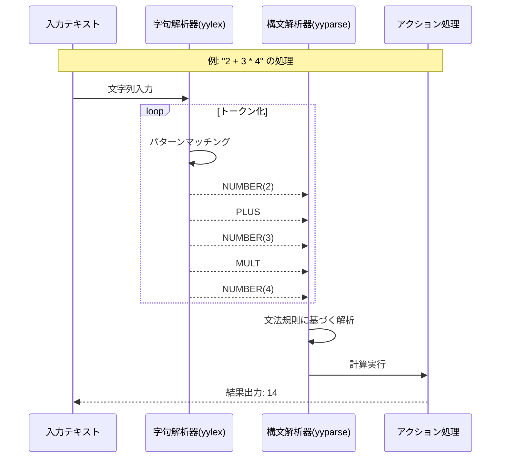

# 簡易電卓

この例では、lexとyaccを組み合わせて、四則演算（加減乗除）が可能な簡単な電卓を実装しています。

## LexとYaccの連携の詳細



この図は、入力テキスト "2 + 3 * 4" が字句解析され、構文解析され、最終的に計算結果が得られるまでの過程を示しています。

## 学習ポイント

- lexとyaccの連携方法
- 文法規則の定義
- 式の評価と計算

## 実行方法

```bash
make
./calc
```

プログラムを実行し、数式（例：`2 + 3 * 4`）を入力すると、計算結果が表示されます。

## コードの説明

### calc.l（字句解析部分）

数字や演算子などのトークンを定義しています。各トークンは構文解析器に渡されます。

### calc.y（構文解析部分）

文法規則と、それに対応するアクション（計算処理）を定義しています。主な特徴：

1. 演算子の優先順位を定義：乗算・除算は加算・減算より優先される
2. 左再帰的な文法規則を使用して式を定義
3. 各規則に対応するアクションで実際の計算を実行

この例は、字句解析と構文解析がどのように連携するかを示す基本的な例です。入力テキストがどのように処理され、構造化された計算に変換されるかを学ぶことができます。
